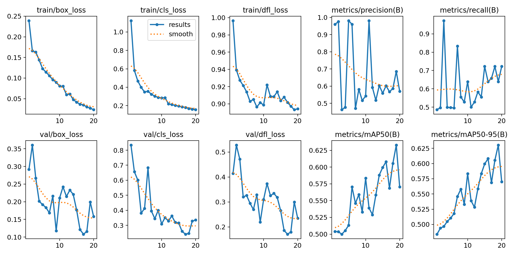
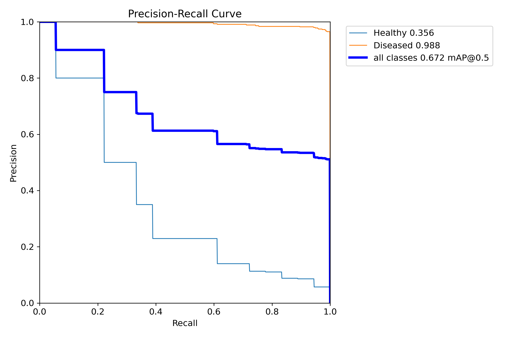
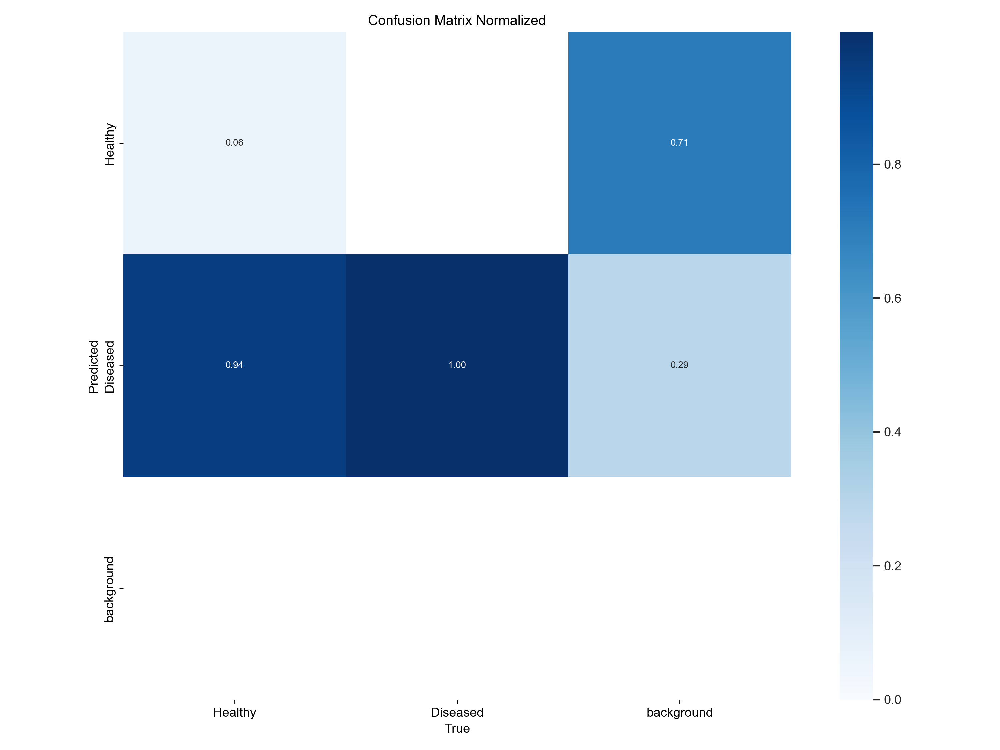
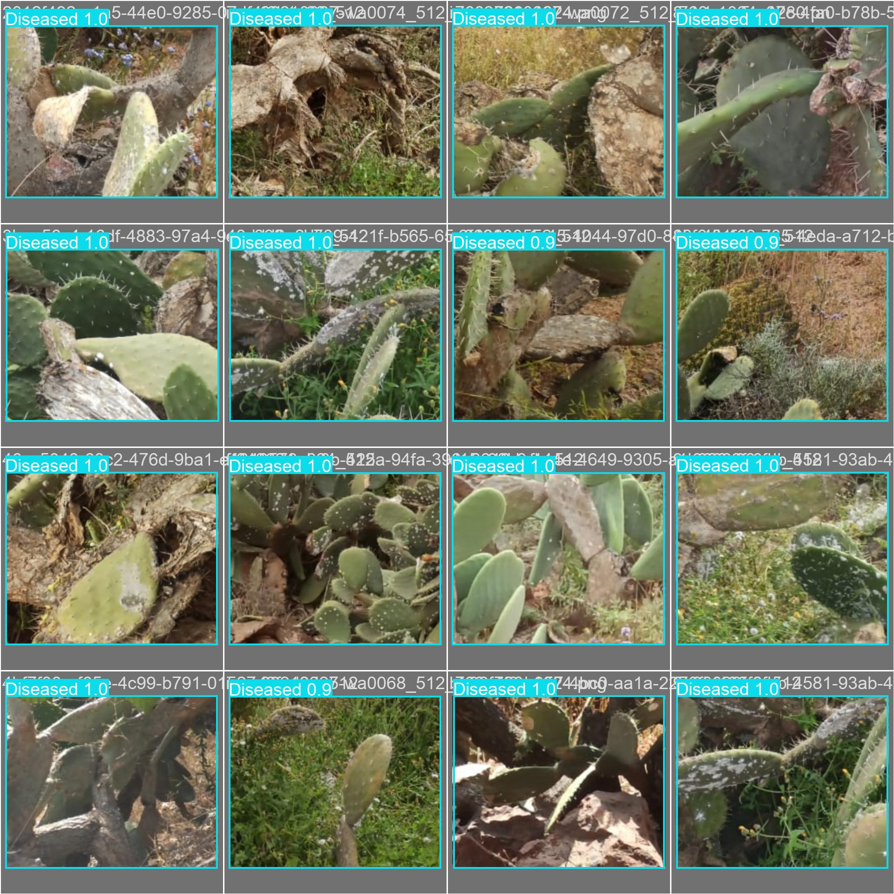

# Prickly Pear Disease Detection

Deep-learning experiments for detecting healthy and diseased prickly pear plants in images and webcam video. The repository contains a YOLOv8 object-detection pipeline, a MobileNet notebook, trained checkpoints, and the plots generated during training and validation.

## Highlights

- Binary object detection: `Healthy` and `Diseased`
- YOLOv8 Nano training and inference
- Webcam inference with bounding boxes and confidence scores
- MobileNet classification experiment in `Mobilenet.ipynb`
- Reproducible training artifacts: YAML configuration, CSV metrics, plots, and epoch checkpoints

## Scientific Results

The strongest recorded experiment is `train3`, trained with YOLOv8 Nano for 20 epochs at a `640 x 640` image size. The values below are taken from [`train3/results.csv`](datasets/runs/detect/train3/results.csv) and report the best validation row rather than assuming that the final epoch is optimal.

| Experiment | Input | Best epoch | Precision | Recall | mAP@50 | mAP@50-95 |
| --- | ---: | ---: | ---: | ---: | ---: | ---: |
| `train3` | 640 px | 19 | 0.6859 | 0.6389 | 0.6328 | 0.6303 |
| `train4` | 256 px | 17 | 0.9814 | 0.5000 | 0.5674 | 0.5659 |

The `train3` run reached a lower final training box loss (`0.02336`) and its best validation mAP@50-95 was achieved before the final epoch. The webcam script currently loads `train4/weights/last.pt`; this is a smaller-input deployment checkpoint, not the best-scoring experiment in the table.

### Training curves



### Precision-recall behavior

The saved `train3` precision-recall artifact reports class AP values of `0.356` for Healthy and `0.988` for Diseased, with an all-class mAP@0.5 of `0.672` for that validation snapshot.



### Normalized confusion matrix

This matrix is normalized by class and includes a background column/row, making missed detections and background effects visible alongside class assignments.



### Qualitative validation predictions

The validation montage below shows the model's predicted bounding boxes and confidence scores on held-out images.



For comparison, the corresponding annotation montage is available at [`val_batch0_labels.jpg`](datasets/runs/detect/train3/val_batch0_labels.jpg).

## Method

The main detector is initialized from `yolov8n.pt` and trained with Ultralytics YOLO. The `train3` configuration uses 20 epochs, batch size 16, 640 px images, automatic optimizer selection, deterministic seed `0`, validation during training, and standard augmentation. The complete configuration is preserved in [`train3/args.yaml`](datasets/runs/detect/train3/args.yaml).

The dataset uses two object classes:

1. `Healthy`
2. `Diseased`

The model predicts a bounding box, class label, and confidence score for each detected plant region. In the webcam view, healthy detections are drawn in green and diseased detections in red.

## Installation

```bash
git clone https://github.com/Amine-Sridi/Prickly-Pear-Disease-Detection.git
cd Prickly-Pear-Disease-Detection
python -m pip install -r requirements.txt
```

Python 3.8 or newer is recommended. The dependency list includes PyTorch/Ultralytics-compatible packages, OpenCV, TensorFlow/Keras, Jupyter, and the plotting stack used by the notebooks.

## Usage

### Webcam inference

Run:

```bash
python realtime.py
```

Press `q` to stop. Before running, check the camera index in `realtime.py` (`cv2.VideoCapture(1)`) and change it to `0` if the default camera is required.

### Training notebooks

- [`YoLo.ipynb`](YoLo.ipynb): YOLOv8 detection training and evaluation
- [`Mobilenet.ipynb`](Mobilenet.ipynb): MobileNet classification experiment

The saved YOLO runs can be found under [`datasets/runs/detect`](datasets/runs/detect). Each run contains its training arguments, `results.csv`, generated plots, validation montages, and model weights.

## Repository Layout

```text
.
├── realtime.py                 # Webcam inference entry point
├── YoLo.ipynb                  # YOLOv8 training notebook
├── Mobilenet.ipynb              # MobileNet training notebook
├── requirements.txt             # Python dependencies
├── yolov8n.pt                  # Base YOLOv8 Nano weights
└── datasets/runs/detect/
    ├── train/                   # Training run 1
    ├── train2/                  # Training run 2
    ├── train3/                  # 640 px experiment and plots
    └── train4/                  # 256 px experiment used by realtime.py
```

## Limitations and Next Steps

- The reported metrics come from the saved validation artifacts and should be confirmed on an independent test set before field deployment.
- The class-level results are uneven, so confidence thresholds and class-specific error analysis deserve further tuning.
- `realtime.py` loads `last.pt` from `train4`; selecting a checkpoint from `train3` requires changing the model path and testing latency on the target camera.
- Dataset provenance, split sizes, and class counts are not documented in the current repository and should be added for a complete scientific report.

